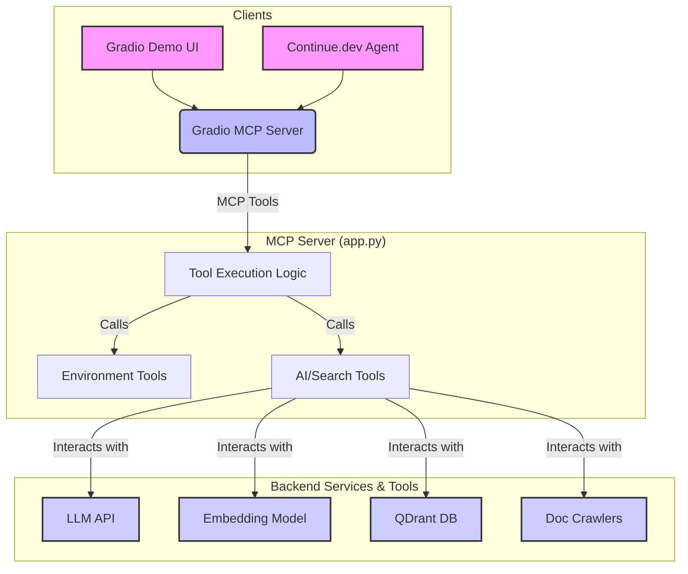

# OpenProblems Spatial Transcriptomics MCP Server

This project provides a Model Context Protocol (MCP) server designed to streamline AI agent interaction with critical bioinformatics tools for spatial transcriptomics workflows within the OpenProblems ecosystem.

## 🚀 How to Run the Demo

There are two primary ways to run the application: locally using Python or with Docker.

### 1. Local Execution

This is the recommended method for development and testing.

**Prerequisites:**
- Python 3.9+
- All dependencies from `requirements.txt`
- Nextflow, Viash, and Docker installed and available in your system's PATH.

**Instructions:**

1.  **Clone the repository:**
    ```bash
    git clone https://github.com/openproblems-bio/SpatialAI_MCP.git
    cd SpatialAI_MCP
    ```

2.  **Install dependencies:**
    ```bash
    pip install -e .
    ```

3.  **Launch the Gradio application:**
    ```bash
    python app.py
    ```

4.  **Access the interface** by navigating to `http://localhost:7860` in your web browser.

### 2. Docker Deployment

This method is ideal for a stable, containerized deployment.

**Prerequisites:**
- Docker and Docker Compose

**Instructions:**

1.  **Clone the repository** (if you haven't already).

2.  **(Optional) Configure API Keys:** Create a `.env` file in the project root to manage your API keys securely:
    ```
    OPENAI_API_KEY=your_openai_key_here
    MIXEDBREAD_API_KEY=your_mixedbread_key_here
    ```

3.  **Build and run with Docker Compose:**
    ```bash
    docker-compose -f docker/docker-compose.yml up --build
    ```

4.  **Access the interface** by navigating to `http://localhost:7860` in your web browser.

## Architecture

The following diagram illustrates the complete system architecture:



## 🤖 AI Agent Integration (Continue.dev)

To connect this MCP server with the Continue.dev IDE extension, ensure the server is running (either locally or via Docker) and add the following to your `~/.continue/config.json`:

```json
{
  "experimental": {
    "modelContextProtocolServers": [
      {
        "name": "openproblems-spatial",
        "transport": {
          "type": "stdio",
          "command": "python",
          "args": ["-m", "src.mcp_server.main"],
          "cwd": "/path/to/your/SpatialAI_MCP"
        }
      }
    ]
  }
}
```
*Replace `/path/to/your/SpatialAI_MCP` with the absolute path to this repository.*