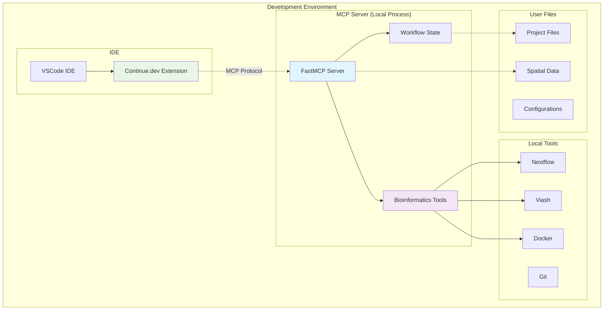

# OpenProblems Spatial Transcriptomics MCP Server

A production-ready Model Context Protocol (MCP) server for OpenProblems spatial transcriptomics workflows, built with [FastMCP 2.0](https://gofastmcp.com/) and designed to work seamlessly with Continue.dev in VSCode.

## 🎯 Purpose

This MCP server provides **bioinformatics-specific tools** that complement Continue.dev's built-in capabilities, focusing on:

- **Spatial transcriptomics domain expertise** (data validation, method development)
- **Bioinformatics tool execution** (Nextflow, Viash, Docker)
- **OpenProblems ecosystem integration** (benchmarking, method validation)
- **Workflow state management** (long-running pipeline tracking)

> **Note**: This server does NOT duplicate Continue.dev's built-in file operations, terminal commands, or git functionality. Instead, it provides specialized bioinformatics capabilities that work alongside Continue.dev's existing tools.

## 🚀 Quick Start

### Installation

```bash
pip install openproblems-spatial-mcp
```

### Continue.dev Configuration

Add to your Continue.dev configuration (`~/.continue/config.json`):

```json
{
  "mcpServers": {
    "openproblems-spatial": {
      "command": "openproblems-mcp-server",
      "args": [],
      "env": {
        "OPENPROBLEMS_MCP_LOG_LEVEL": "INFO"
      }
    }
  }
}
```

### Basic Usage

1. **Check server health**:
   ```bash
   openproblems-mcp check
   ```

2. **Start the server** (usually automatic via Continue.dev):
   ```bash
   openproblems-mcp-server
   ```

3. **Initialize configuration**:
   ```bash
   openproblems-mcp init
   ```

## 🏗️ Architecture

The system operates as invisible local infrastructure in your development environment:



## 🔧 Tools

The server currently exposes **read-only analysis and validation** tools. It does
not yet execute pipelines — execution tools are on the roadmap (see below). The
table reflects exactly what is registered in `server.py` today.

### ✅ Available now

**Core infrastructure**
- `health_check`: Check server and detected-tool status
- `list_tools_status`: List bioinformatics tool availability with install hints
- `get_server_info`: Get server configuration details

**Spatial transcriptomics validation & analysis**
- `validate_spatial_data`: Validate SpatialData / zarr / AnnData format integrity
- `validate_multiple_spatial_files`: Batch-validate files with summary statistics
- `analyze_spatial_metadata`: Extract spatial coordinates and gene/feature metadata
- `check_spatial_data_compatibility`: Check files for joint-analysis compatibility
- `extract_bioinformatics_metadata`: Extract metadata from Nextflow/Viash/spatial files
- `analyze_workflow_configuration`: Analyze Nextflow/Viash config structure & deps
- `assess_data_quality`: Cross-file data-quality assessment
- `analyze_workflow_dependencies`: Find dependency requirements/conflicts across files

### 🛣️ Roadmap (NOT yet implemented)

These appear in the design (`project_artifacts/project_details.md`) and the kiro
task board (`.kiro/specs/production-mcp-server/tasks.md`), but **no code backs
them yet**. Do not rely on them; an agent that calls them will get an error.

- Execution: `run_nextflow_workflow`, `run_viash_component`, `build_viash_component`,
  `build_docker_image`, `run_nf_test`
- Troubleshooting: `analyze_nextflow_log`
- Authoring: `create_spatial_component`, `setup_spatial_environment`
- OpenProblems: `analyze_openproblems_repo`, `build_openproblems_method`,
  `run_openproblems_benchmark`, `validate_openproblems_submission`
- Workflow state: `get_execution_status`, `cancel_execution`, `get_execution_history`

## 📊 Available Resources

- `config://server`: Server configuration (JSON)
- `status://tools`: Tool detection status (JSON)
- `status://health`: Overall health status (JSON)

## ⚙️ Configuration

### Default Configuration

The server works out-of-the-box with sensible defaults. Optional configuration:

- `~/.openproblems-mcp/config.yaml` (user-wide)
- `.openproblems-mcp.yaml` (project-specific)

### Example Configuration

```yaml
server:
  log_level: INFO
  max_concurrent_executions: 3
  default_timeout_seconds: 3600
  workspace_root: "."

tools:
  nextflow_executable: nextflow
  viash_executable: viash
  docker_executable: docker
  git_executable: git
  python_executable: python
```

### Environment Variables

- `OPENPROBLEMS_MCP_WORKSPACE_ROOT`: Workspace directory
- `OPENPROBLEMS_MCP_LOG_LEVEL`: Logging level (DEBUG, INFO, WARNING, ERROR)
- `OPENPROBLEMS_MCP_MAX_CONCURRENT`: Max concurrent executions
- `OPENPROBLEMS_MCP_TIMEOUT`: Default timeout in seconds
- `OPENPROBLEMS_MCP_NEXTFLOW_EXECUTABLE`: Nextflow executable path
- `OPENPROBLEMS_MCP_VIASH_EXECUTABLE`: Viash executable path
- `OPENPROBLEMS_MCP_DOCKER_EXECUTABLE`: Docker executable path

## 🔄 Integration with Continue.dev

This server **complements** Continue.dev's built-in tools:

### Continue.dev Built-ins (We DON'T duplicate)
- File operations (`read_file`, `create_new_file`)
- Search operations (`exact_search`, `file_glob_search`)
- Terminal commands (`run_terminal_command`)
- Git operations (`view_diff`)
- Directory operations (`view_subdirectory`)

### Our Specialized Tools (Unique value)
- Bioinformatics tool execution and management
- Spatial transcriptomics domain expertise
- OpenProblems ecosystem integration
- Long-running workflow state management
- Domain-specific error analysis and remediation

## 🧬 Use Cases

### Spatial Transcriptomics Method Development
```
Continue.dev Agent: "I need to develop a spatial clustering method"
↓
1. Agent uses Continue.dev's file tools to read existing code
2. Agent calls our validate_spatial_data to check test data
3. Agent calls our create_spatial_component to generate Viash component
4. Agent uses Continue.dev's terminal to run tests
5. Agent calls our build_openproblems_method to prepare submission
```

### Nextflow Pipeline Development
```
Continue.dev Agent: "Let's optimize this Nextflow pipeline"
↓
1. Agent uses Continue.dev's file tools to read pipeline code
2. Agent calls our run_nextflow_workflow to test execution
3. Agent calls our get_execution_status to monitor progress
4. Agent uses Continue.dev's diff tools to review changes
5. Agent calls our validate_openproblems_submission to check compliance
```

## 🛠️ Development

### Local Development Setup

```bash
git clone https://github.com/openproblems-bio/SpatialAI_MCP.git
cd SpatialAI_MCP

# Install in development mode
pip install -e ".[dev]"

# Run tests
pytest

# Format code
black src/
ruff check src/
```

### Project Structure

```
src/openproblems_mcp/
├── __init__.py          # Package initialization
├── main.py              # Main entry point
├── server.py            # FastMCP server core
├── cli.py               # CLI commands
├── config.py            # Configuration management
├── tool_detection.py    # Tool detection logic
└── exceptions.py        # Error handling
```

## 📋 Requirements

### System Requirements
- Python 3.8 or higher
- Operating System: Linux, macOS, or Windows

### Optional Tools (Auto-detected)
- **Nextflow**: For pipeline execution
- **Viash**: For component building and execution
- **Docker**: For container operations
- **Git**: For repository operations
- **Python/Conda**: For environment management

## 🚦 Current Status

### ✅ Implemented
- ✅ Clean Python package structure, pip-installable with CLI commands
- ✅ FastMCP-based server architecture (stdio)
- ✅ Logging, configuration management, local tool detection
- ✅ Health monitoring and status reporting
- ✅ Spatial data validation (SpatialData / zarr / AnnData) — kiro Task 2.1
- ✅ Bioinformatics metadata extraction & workflow-config analysis — kiro Task 2.2

### 🚧 Roadmap (not yet implemented)
- 🚧 Local bioinformatics tool execution: Nextflow / Viash / Docker — kiro Task 3
- 🚧 Workflow state management & execution history — kiro Task 5
- 🚧 OpenProblems ecosystem integration — kiro Task 5
- 🚧 Provider-agnostic skill installer (Claude, Codex, Cursor, Copilot) — see `installer/`

See `.kiro/specs/production-mcp-server/tasks.md` for the full task board.

## 🤝 Why FastMCP?

FastMCP 2.0 provides:
- **Minimal boilerplate**: Focus on functionality, not protocol details
- **Production-ready**: Built for real-world deployment scenarios
- **High performance**: Optimized for MCP protocol efficiency
- **Pythonic**: Clean, intuitive API design
- **Comprehensive**: Full MCP ecosystem support

This implementation is significantly cleaner and more maintainable than raw MCP protocol implementations.

## 📚 Documentation

- **Installation Guide**: See Quick Start section above
- **API Reference**: Coming soon
- **Continue.dev Integration**: See Integration section above
- **Troubleshooting**: Use `openproblems-mcp check` for diagnostics

## 🤝 Contributing

We welcome contributions! Please:

1. Focus on bioinformatics-specific functionality
2. Avoid duplicating Continue.dev built-in tools
3. Follow the FastMCP patterns established in the codebase
4. Add tests for new functionality

## 📄 License

This project is licensed under the MIT License - see the [LICENSE](LICENSE) file for details.

## 🙏 Acknowledgments

- **OpenProblems Initiative**: For standardizing benchmarking in spatial biology
- **FastMCP**: For providing an excellent MCP framework
- **Continue.dev**: For creating a powerful AI coding assistant platform

## 📞 Support

- **GitHub Issues**: [Report bugs and request features](https://github.com/openproblems-bio/SpatialAI_MCP/issues)
- **Health Check**: Run `openproblems-mcp check` for diagnostics
- **OpenProblems**: [Learn about OpenProblems](https://openproblems.bio)
