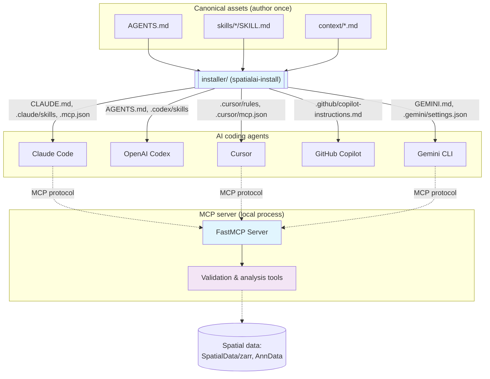

# OpenProblems Spatial Transcriptomics Co-pilot

An AI co-pilot for computational biologists working on the
[OpenProblems](https://openproblems.bio) spatial transcriptomics benchmarks. It
ships two complementary pieces:

1. **An MCP server** (`src/openproblems_mcp/`) — domain-aware validation and
   analysis tools, built with [FastMCP](https://gofastmcp.com/) and exposed over
   the Model Context Protocol so any MCP-capable agent can use them.
2. **A provider-agnostic skill installer** (`installer/`) — author rules, skills,
   and domain context **once** (`AGENTS.md`, `skills/`, `context/`) and install
   them into Claude Code, OpenAI Codex, Cursor, GitHub Copilot, or Gemini CLI.

## 🎯 Purpose

Provide **bioinformatics-specific capability** that complements an agent's
built-in file/terminal/git tools, focusing on:

- **Spatial transcriptomics domain expertise** (data validation, metadata analysis)
- **OpenProblems ecosystem alignment** (SpatialData/zarr, Viash, the iST pipeline)
- **Portable agent setup** (one set of rules/skills, every major coding agent)

> The server does NOT duplicate an agent's built-in file operations, terminal
> commands, or git functionality. It adds specialized analysis that works
> alongside them. Pipeline *execution* is on the roadmap — see Tools below.

## 🚀 Quick Start

### Installation

```bash
pip install -e .          # from a clone; provides both CLI entry points
```

### Set up your agent (provider-agnostic)

Install the rules, skills, and MCP config into whichever agent you use:

```bash
spatialai-install list                       # see targets and skills
spatialai-install install --target claude    # or codex / cursor / copilot / gemini / all
```

This generates the right files for that agent (e.g. `CLAUDE.md` + `.claude/skills/`
+ `.mcp.json` for Claude Code; `.cursor/rules/*.mdc` + `.cursor/mcp.json` for
Cursor). See [`installer/README.md`](installer/README.md) for the full mapping.

**Claude Code plugin (one-step alternative):**

```text
/plugin marketplace add Rebell-Leader/SpatialAI_MCP
/plugin install openproblems-spatial@openproblems-spatial
```

This bundles the four skills and the MCP server config as a single plugin. The
MCP tools still require the `pip install` above (they run the
`openproblems-mcp-server` console script).

> New here? **[QUICKSTART.md](QUICKSTART.md)** walks you from install to a
> validated dataset and a scaffolded Viash component in about 5 minutes.

### Basic Usage

1. **Check server health**:
   ```bash
   openproblems-mcp check
   ```

2. **Start the server** (usually launched automatically by your agent over stdio):
   ```bash
   openproblems-mcp-server
   ```

3. **Initialize server configuration**:
   ```bash
   openproblems-mcp init
   ```

## 🏗️ Architecture

The co-pilot has two layers: provider-neutral **assets** that the installer
projects into each agent, and the **MCP server** that any agent then calls.



## 🔧 Tools

The server currently exposes **read-only analysis and validation** tools. It does
not yet execute pipelines — execution tools are on the roadmap (see below). The
table reflects exactly what is registered in `server.py` today.

### ✅ Available now

**Core infrastructure**
- `health_check`: Check server and detected-tool status
- `list_tools_status`: List bioinformatics tool availability with install hints
- `get_server_info`: Get server configuration details

**Spatial transcriptomics validation & analysis**
- `validate_spatial_data`: Validate SpatialData / zarr / AnnData format integrity
- `validate_multiple_spatial_files`: Batch-validate files with summary statistics
- `analyze_spatial_metadata`: Extract spatial coordinates and gene/feature metadata
- `check_spatial_data_compatibility`: Check files for joint-analysis compatibility
- `extract_bioinformatics_metadata`: Extract metadata from Nextflow/Viash/spatial files
- `analyze_workflow_configuration`: Analyze Nextflow/Viash config structure & deps
- `assess_data_quality`: Cross-file data-quality assessment
- `analyze_workflow_dependencies`: Find dependency requirements/conflicts across files

### 🛣️ Roadmap (NOT yet implemented)

These appear in the project design notes, but **no code backs them yet**. Do not
rely on them; an agent that calls them will get an error. The original
requirements for these live in the archived hackathon spec
([`docs/archive/kiro-spec-production-mcp-server/`](docs/archive/kiro-spec-production-mcp-server/)).

- Execution: `run_nextflow_workflow`, `run_viash_component`, `build_viash_component`,
  `build_docker_image`, `run_nf_test`
- Troubleshooting: `analyze_nextflow_log`
- Authoring: `create_spatial_component`, `setup_spatial_environment`
- OpenProblems: `analyze_openproblems_repo`, `build_openproblems_method`,
  `run_openproblems_benchmark`, `validate_openproblems_submission`
- Workflow state: `get_execution_status`, `cancel_execution`, `get_execution_history`

## 📊 Available Resources

- `config://server`: Server configuration (JSON)
- `status://tools`: Tool detection status (JSON)
- `status://health`: Overall health status (JSON)

## ⚙️ Configuration

### Default Configuration

The server works out-of-the-box with sensible defaults. Optional configuration:

- `~/.openproblems-mcp/config.yaml` (user-wide)
- `.openproblems-mcp.yaml` (project-specific)

### Example Configuration

```yaml
server:
  log_level: INFO
  max_concurrent_executions: 3
  default_timeout_seconds: 3600
  workspace_root: "."

tools:
  nextflow_executable: nextflow
  viash_executable: viash
  docker_executable: docker
  git_executable: git
  python_executable: python
```

### Environment Variables

- `OPENPROBLEMS_MCP_WORKSPACE_ROOT`: Workspace directory
- `OPENPROBLEMS_MCP_LOG_LEVEL`: Logging level (DEBUG, INFO, WARNING, ERROR)
- `OPENPROBLEMS_MCP_MAX_CONCURRENT`: Max concurrent executions
- `OPENPROBLEMS_MCP_TIMEOUT`: Default timeout in seconds
- `OPENPROBLEMS_MCP_NEXTFLOW_EXECUTABLE`: Nextflow executable path
- `OPENPROBLEMS_MCP_VIASH_EXECUTABLE`: Viash executable path
- `OPENPROBLEMS_MCP_DOCKER_EXECUTABLE`: Docker executable path

## 🔄 How it complements your agent

This co-pilot **complements** an agent's built-in tools rather than duplicating
them. The agent handles file I/O, search, terminal, and git; the co-pilot adds:

- Spatial transcriptomics domain expertise (validation, metadata, compatibility)
- OpenProblems ecosystem alignment (SpatialData/zarr, Viash, the iST pipeline)
- Portable, provider-neutral rules and skills via the installer

## 🧬 Use Cases

### Spatial transcriptomics method development
```
You: "Help me add a segmentation method to task_ist_preprocessing"
↓
1. Agent reads existing code with its own file tools
2. Agent loads the viash-component-authoring skill (installed from skills/)
3. Agent calls validate_spatial_data to check the test data
4. Agent scaffolds the config.vsh.yaml + script, then runs `viash` in the terminal
5. Agent calls analyze_workflow_configuration to check the config before building
```

### Debugging a benchmark run
```
You: "This nextflow run failed, why?"
↓
1. Agent loads the nextflow-debugging skill
2. Agent inspects the failing task's work-dir logs with its terminal tools
3. Agent calls validate_spatial_data if the failure looks data-shaped
4. Agent reports root cause (OOM / missing tool / data format) and the fix
```

> Execution tools (`run_nextflow_workflow`, etc.) are roadmap; today the agent
> drives the user's local `nextflow`/`viash`/`docker` CLIs directly.

## 🛠️ Development

### Local Development Setup

```bash
git clone https://github.com/Rebell-Leader/SpatialAI_MCP.git
cd SpatialAI_MCP

# Install in development mode
pip install -e ".[dev]"

# Run tests
pytest

# Format code
black src/
ruff check src/
```

### Project Structure

```
AGENTS.md                    # Canonical, provider-neutral agent rules (source of truth)
skills/                      # On-demand task playbooks (shared SKILL.md format)
context/                     # OpenProblems facts, data-format & pipeline contracts
installer/                   # Provider-agnostic skill installer (spatialai-install)
case-study/                  # Runnable experiment: skill vs. plain agent (+ grader, runner)
.claude-plugin/              # Plugin marketplace manifests (installable via /plugin)
src/openproblems_mcp/        # The MCP server
├── server.py                #   FastMCP server core (tool/resource registration)
├── spatial_validation.py    #   SpatialData/zarr/AnnData validation
├── metadata_analysis.py     #   Bioinformatics metadata extraction
├── spatial_tools.py         #   Tool wrappers exposed over MCP
├── tool_detection.py        #   Local tool detection
├── config.py / cli.py / main.py / exceptions.py
tests/                       # pytest suite (server, validation, metadata, installer, case-study)
```

Generated per-agent files (`CLAUDE.md`, `GEMINI.md`, `.claude/`, `.codex/`,
`.cursor/`, `.gemini/`, `.github/copilot-instructions.md`, `.mcp.json`) are
produced by the installer — edit `AGENTS.md` / `skills/` and re-run
`spatialai-install`, not those files.

## 🔬 Case study: does the skill close the model gap?

[`case-study/`](case-study/) is a runnable experiment that tests whether an
open-source model **with** this skill can match a frontier commercial model
**without** it on a real `task_ist_preprocessing` task — at fewer agent steps and
fewer human validations. It ships the frozen task, an objective rubric, an
automated grader (`case-study/grade.py`), reference components that bracket the
rubric, and a [runner](case-study/runner/README.md) that drives Gemini CLI /
opencode arms and grades them. Smoke-test the whole pipeline offline first:

```bash
python case-study/runner/run.py --config case-study/runner/arms.example.json \
  --mock-harness skill-aware
```

See [`case-study/README.md`](case-study/README.md).

## 📋 Requirements

### System Requirements
- Python 3.10 or higher (required by the `fastmcp` dependency)
- Operating System: Linux, macOS, or Windows

### Optional Tools (auto-detected by the server, not required)
- **Nextflow / Viash / Docker**: for building and running pipelines yourself
  (the agent drives these via the terminal; the server only detects them)
- **Git**: for repository operations
- **`[spatial]` extras** (`pip install -e ".[spatial]"`): spatialdata, zarr,
  anndata, h5py — needed only for deep data-internals validation

## 🚦 Current Status

### ✅ Implemented
- ✅ FastMCP-based MCP server (stdio), pip-installable with CLI commands
- ✅ Spatial data validation (SpatialData / zarr / AnnData) + metadata/config analysis
- ✅ Logging, configuration management, local tool detection, health monitoring
- ✅ Provider-agnostic installer for **5 agents** (Claude, Codex, Cursor, Copilot, Gemini CLI)
- ✅ Skills + context grounded in the current OpenProblems iST pipeline
- ✅ Installable Claude Code plugin (`.claude-plugin/`)
- ✅ Case-study harness with automated grader and offline mock mode
- ✅ CI: tests on Python 3.10–3.12, generated-files-in-sync check, upstream-drift check

### 🚧 Roadmap (not yet implemented)
- 🚧 In-server pipeline **execution** (Nextflow / Viash / Docker)
- 🚧 Workflow state management & execution history
- 🚧 OpenProblems build / benchmark / submission tools

Until those land, the agent drives your local `nextflow` / `viash` / `docker`
CLIs directly. Detailed requirements for these are preserved in the archived
hackathon spec ([`docs/archive/kiro-spec-production-mcp-server/`](docs/archive/kiro-spec-production-mcp-server/)).

## 📚 Documentation

- **Quickstart**: [QUICKSTART.md](QUICKSTART.md) — install to first result in ~5 min
- **Agent rules (source of truth)**: [AGENTS.md](AGENTS.md)
- **Installer & per-agent mapping**: [installer/README.md](installer/README.md)
- **Domain context**: [context/](context/) (data formats, the iST pipeline)
- **Case study**: [case-study/README.md](case-study/README.md)
- **Troubleshooting**: run `openproblems-mcp check` for diagnostics

## 🤝 Contributing

Contributions welcome. Please:

1. Edit the canonical assets (`AGENTS.md`, `skills/`, `context/`) — never the
   generated per-agent files; re-run `spatialai-install` to regenerate them.
2. Keep `README.md`, `AGENTS.md`, and the kiro task board honest about what is
   actually implemented; don't advertise roadmap tools as available.
3. Add tests for new functionality (`python -m pytest`).

## 📄 License

This project is licensed under the MIT License — see the [LICENSE](LICENSE) file for details.

## 🙏 Acknowledgments

- **OpenProblems Initiative**: for standardizing benchmarking in spatial biology
- **FastMCP**: for the MCP server framework
- **The `AGENTS.md` standard** and the Claude/Codex/Cursor/Copilot/Gemini
  ecosystems this co-pilot projects into

## 📞 Support

- **GitHub Issues**: [Report bugs and request features](https://github.com/Rebell-Leader/SpatialAI_MCP/issues)
- **Health Check**: run `openproblems-mcp check` for diagnostics
- **OpenProblems**: [Learn about OpenProblems](https://openproblems.bio)
