# OpenProblems Agent Integration Guide

## Complete Setup Overview

This guide shows how to integrate the **Agent Rules**, **Agent Prompt**, and **Continue.dev Configuration** for optimal spatial transcriptomics AI assistance.

## 📋 Integration Checklist

### 1. **Continue.dev Configuration**
✅ **File**: `~/.continue/config.json`
✅ **Purpose**: Connects Continue.dev to your MCP server
✅ **Key Component**:
```json
"experimental": {
  "modelContextProtocolServers": [
    {
      "name": "openproblems-spatial",
      "transport": {
        "type": "stdio",
        "command": "python",
        "args": ["-m", "mcp_server.main"],
        "cwd": "/home/obi/SpatialAI_MCP"
      }
    }
  ]
}
```

### 2. **Agent Rules**
✅ **File**: `docs/AGENT_RULES.md`
✅ **Purpose**: Comprehensive guidelines for spatial transcriptomics best practices
✅ **Usage**: Continue.dev agent references these rules automatically when integrated

### 3. **Agent Prompt**
✅ **File**: `docs/AGENT_PROMPT.md`
✅ **Purpose**: Sophisticated agent behavior definition
✅ **Integration**: Add to Continue.dev system prompt or rules section

## 🔧 **Final Continue.dev Configuration**

Update your `~/.continue/config.json` to include the agent prompt:

```json
{
  "models": [
    {
      "title": "Claude 3.5 Sonnet",
      "provider": "anthropic",
      "model": "claude-3-5-sonnet-20241022",
      "apiKey": "your-anthropic-api-key-here"
    }
  ],
  "experimental": {
    "modelContextProtocolServers": [
      {
        "name": "openproblems-spatial",
        "transport": {
          "type": "stdio",
          "command": "python",
          "args": ["-m", "mcp_server.main"],
          "cwd": "/home/obi/SpatialAI_MCP"
        }
      }
    ]
  },
  "systemMessage": "You are an expert computational biology assistant specializing in spatial transcriptomics analysis using the OpenProblems framework. You have access to a comprehensive Model Context Protocol (MCP) server with 11 specialized tools and 5 curated knowledge resources. Always start interactions by checking the environment using check_environment tool, then assess project structure with list_directory. Follow the systematic workflow guidelines in AGENT_RULES.md for optimal results.",
  "docs": [
    {
      "title": "Nextflow Documentation",
      "startUrl": "https://www.nextflow.io/docs/latest/"
    },
    {
      "title": "Viash Documentation",
      "startUrl": "https://viash.io/docs/"
    },
    {
      "title": "OpenProblems GitHub",
      "startUrl": "https://github.com/openproblems-bio/openproblems-v2"
    },
    {
      "title": "Spatial Transcriptomics Task",
      "startUrl": "https://github.com/openproblems-bio/task_spatial_decomposition"
    }
  ]
}
```

## 🚀 **Testing Your Complete Setup**

### Step 1: Verify MCP Server
```bash
cd /home/obi/SpatialAI_MCP
python -m mcp_server.main
# Should start without errors
```

### Step 2: Test Continue.dev Integration
1. **Restart VS Code** after updating config
2. **Open Continue.dev** (Cmd/Ctrl + L)
3. **Test Query**: "Check my spatial transcriptomics environment and help me create a quality control pipeline"

### Step 3: Expected Agent Behavior
The agent should:
- ✅ Use `check_environment` tool first
- ✅ Use `list_directory` to assess project structure
- ✅ Reference OpenProblems best practices
- ✅ Generate Viash-compatible components
- ✅ Create Nextflow DSL2 pipelines
- ✅ Follow all rules from AGENT_RULES.md

## 🎯 **Expected Interaction Flow**

```mermaid
graph TD
    A["👩‍💻 User Query<br/>'Help with spatial QC'"] --> B["🤖 Agent Assessment<br/>check_environment tool"]
    B --> C["📁 Project Analysis<br/>list_directory tool"]
    C --> D["📚 Rules Reference<br/>AGENT_RULES.md guidelines"]
    D --> E["🛠️ Solution Creation<br/>write_file + validate tools"]
    E --> F["✅ Quality Validation<br/>test and verify output"]
    F --> G["📋 Comprehensive Response<br/>Code + Documentation + Next Steps"]
```



## 📝 **Example Successful Interaction**

**User**: "I need help setting up spatial transcriptomics quality control"

**Agent Response**:
```
I'll help you set up comprehensive spatial transcriptomics quality control. Let me first assess your environment and project structure.

[Uses check_environment tool]
✅ Docker: Available (v28.1.1)
❌ Nextflow: Not found
❌ Viash: Not found

[Uses list_directory tool]
Found spatial data in: data/spatial_samples/
Existing configs: config/

Based on the OpenProblems best practices, I'll:
1. Install missing dependencies
2. Create a modular QC pipeline
3. Generate Viash components
4. Set up comprehensive testing

[Creates optimized pipeline with proper error handling and documentation]
```

## 🔍 **Troubleshooting**

### Issue: MCP Tools Not Available
**Solution**: Check Continue.dev logs in VS Code Developer Tools
```bash
# Verify MCP server manually
python -m mcp_server.main
openproblems-mcp info
```

### Issue: Agent Not Following Rules
**Solution**: Ensure systemMessage includes rules reference
```json
"systemMessage": "...Follow the systematic workflow guidelines in AGENT_RULES.md..."
```

### Issue: Spatial Analysis Errors
**Solution**: Agent should use validate_nextflow_config tool
```
The agent will automatically validate pipelines using our MCP tools before providing solutions.
```

## 🎉 **Success Indicators**

Your integration is successful when:
- [ ] Agent proactively uses MCP tools (check_environment, list_directory)
- [ ] Generated code follows OpenProblems conventions
- [ ] Pipelines are properly validated before delivery
- [ ] Documentation includes troubleshooting and next steps
- [ ] Solutions are tested and reproducible

**🚀 You now have a complete AI-powered spatial transcriptomics development environment!**
