# Continue.dev MCP Integration Setup Guide

## 1. Local Development Setup (Recommended)

### Continue.dev Configuration

Edit your Continue.dev configuration file:
**Location**: `~/.continue/config.json`

```json
{
  "models": [
    {
      "title": "Claude 3.5 Sonnet",
      "provider": "anthropic",
      "model": "claude-3-5-sonnet-20241022",
      "apiKey": "your-anthropic-api-key"
    }
  ],
  "experimental": {
    "modelContextProtocolServers": [
      {
        "name": "openproblems-spatial",
        "transport": {
          "type": "stdio",
          "command": "python",
          "args": ["-m", "mcp_server.main"],
          "cwd": "/path/to/your/SpatialAI_MCP"
        }
      }
    ]
  },
  "docs": [
    {
      "title": "Nextflow Documentation",
      "startUrl": "https://www.nextflow.io/docs/latest/"
    },
    {
      "title": "Viash Documentation",
      "startUrl": "https://viash.io/docs/"
    },
    {
      "title": "OpenProblems GitHub",
      "startUrl": "https://github.com/openproblems-bio/openproblems-v2"
    },
    {
      "title": "Spatial Transcriptomics Methods",
      "startUrl": "https://github.com/openproblems-bio/task_spatial_decomposition"
    }
  ]
}
```

### Important Configuration Notes

1. **Replace the path**: Change `/path/to/your/SpatialAI_MCP` to your actual project directory
2. **Python environment**: Ensure the `python` command points to the environment where you installed the MCP server
3. **Working directory**: The `cwd` field ensures the MCP server runs from the correct directory

### Verification Steps

```bash
# 1. Navigate to your project directory
cd /path/to/your/SpatialAI_MCP

# 2. Verify your MCP server works
python -m mcp_server.main

# 3. Test CLI tools
openproblems-mcp info
openproblems-mcp tool check_environment

# 4. Generate documentation cache
openproblems-mcp download-docs
```

## 2. Alternative Setup Methods

### Method A: Virtual Environment Activation

If you're using conda/virtualenv, specify the full Python path:

```json
{
  "experimental": {
    "modelContextProtocolServers": [
      {
        "name": "openproblems-spatial",
        "transport": {
          "type": "stdio",
          "command": "/home/obi/miniforge3/bin/python",
          "args": ["-m", "mcp_server.main"],
          "cwd": "/home/obi/SpatialAI_MCP"
        }
      }
    ]
  }
}
```

### Method B: Using Shell Script Wrapper

Create a wrapper script for more control:

**File**: `scripts/start_mcp_server.sh`
```bash
#!/bin/bash
cd /path/to/your/SpatialAI_MCP
source activate your-conda-env  # if using conda
exec python -m mcp_server.main
```

**Continue.dev config**:
```json
{
  "experimental": {
    "modelContextProtocolServers": [
      {
        "name": "openproblems-spatial",
        "transport": {
          "type": "stdio",
          "command": "/path/to/your/SpatialAI_MCP/scripts/start_mcp_server.sh"
        }
      }
    ]
  }
}
```

## 3. Remote Deployment Options

### Option A: HTTP Server (Future Enhancement)

Our current MCP server uses stdio transport. To deploy remotely, you'd need an HTTP wrapper:

```python
# Future: http_server.py
from fastapi import FastAPI
from mcp_server.main import handle_call_tool, handle_list_tools

app = FastAPI()

@app.post("/mcp/call-tool")
async def call_tool_endpoint(request: dict):
    result = await handle_call_tool(request["name"], request["arguments"])
    return {"result": [item.text for item in result]}
```

### Option B: SSH Tunnel (Current Solution)

For remote access with current stdio transport:

```bash
# On remote server
ssh -R 8022:localhost:22 remote-server

# Continue.dev config for SSH tunnel
{
  "experimental": {
    "modelContextProtocolServers": [
      {
        "name": "openproblems-spatial",
        "transport": {
          "type": "stdio",
          "command": "ssh",
          "args": [
            "remote-server",
            "cd /path/to/SpatialAI_MCP && python -m mcp_server.main"
          ]
        }
      }
    ]
  }
}
```

## 4. Testing Your Integration

### Step 1: Test MCP Server Standalone
```bash
cd /path/to/your/SpatialAI_MCP

# Test tools
openproblems-mcp tool echo_test message="Hello MCP"
openproblems-mcp tool check_environment

# Test resources
openproblems-mcp info
```

### Step 2: Test Continue.dev Integration

1. **Restart VS Code** after updating config
2. **Open Continue.dev sidebar** (Cmd/Ctrl + L)
3. **Ask a spatial transcriptomics question**:

```
"Help me create a Nextflow pipeline for spatial transcriptomics quality control"
```

4. **Verify MCP tools are available** - the agent should:
   - Check your environment with `check_environment`
   - Access our documentation resources
   - Create files using `write_file`
   - Validate pipelines with `validate_nextflow_config`

### Step 3: Debug Connection Issues

**Check Continue.dev logs**:
- Open VS Code Developer Tools (Help > Toggle Developer Tools)
- Look for MCP connection errors in Console

**Common issues**:
```bash
# Issue: Python not found
# Solution: Use full Python path
"command": "/usr/bin/python3"

# Issue: Module not found
# Solution: Check working directory and installation
"cwd": "/correct/path/to/SpatialAI_MCP"

# Issue: Permission denied
# Solution: Make script executable
chmod +x scripts/start_mcp_server.sh
```

## 5. Production Deployment Architecture

```mermaid
graph TD
    A["👩‍💻 Computational Biologist<br/>Continue.dev in VS Code"] --> B["🔗 MCP Connection<br/>(stdio transport)"]

    B --> C["📡 OpenProblems MCP Server<br/>python -m mcp_server.main"]

    C --> D["🛠️ Local Tools"]
    C --> E["📚 Cached Documentation"]
    C --> F["🐳 Local Docker"]
    C --> G["⚡ Nextflow Workflows"]

    H["🌐 Continue.dev Docs Crawler"] --> I["📖 Real-time Documentation"]
    I --> J["Nextflow.io"]
    I --> K["Viash.io"]
    I --> L["GitHub OpenProblems"]

    A --> H
```



## 6. Example Agent Interactions

### Scenario 1: Environment Setup
**User**: "Check if my environment is ready for spatial analysis"

**Agent Response**:
```
I'll check your spatial transcriptomics environment using the OpenProblems MCP server.

[Uses MCP tool: check_environment]

Results:
✅ Docker: Available (version 28.1.1)
❌ Nextflow: Not found
❌ Viash: Not found
❌ Java: Not found

I recommend installing the missing tools:
- Nextflow: curl -s https://get.nextflow.io | bash
- Viash: curl -fsSL get.viash.io | bash
- Java: sudo apt install openjdk-17-jre-headless
```

### Scenario 2: Pipeline Creation
**User**: "Create a spatial QC pipeline following OpenProblems standards"

**Agent Response**:
```
I'll create an optimized spatial transcriptomics QC pipeline using the latest
Nextflow best practices and OpenProblems templates.

[Uses MCP resources and tools to]:
1. Get Nextflow DSL2 best practices
2. Access spatial workflow templates
3. Create optimized pipeline file
4. Validate syntax and configuration

[Creates file: spatial_qc_pipeline.nf with production-ready workflow]
```

## 7. Troubleshooting Common Issues

### MCP Server Not Starting
```bash
# Check if server starts manually
cd /path/to/your/SpatialAI_MCP
python -m mcp_server.main

# If it fails, check:
1. Python environment has required packages
2. Working directory is correct
3. No import errors in the logs
```

### Continue.dev Not Detecting MCP Tools
```bash
# Verify MCP protocol compliance
openproblems-mcp info

# Check Continue.dev logs in VS Code Developer Tools
# Look for MCP connection status messages
```

### Tools Failing to Execute
```bash
# Test tools individually
openproblems-mcp tool list_directory directory_path="."
openproblems-mcp tool validate_nextflow_config pipeline_path="test.nf"

# Check file permissions and paths
ls -la /path/to/your/SpatialAI_MCP
```

## 8. Advanced Configuration

### Resource Limits
```json
{
  "experimental": {
    "modelContextProtocolServers": [
      {
        "name": "openproblems-spatial",
        "transport": {
          "type": "stdio",
          "command": "python",
          "args": ["-m", "mcp_server.main"],
          "cwd": "/path/to/your/SpatialAI_MCP"
        },
        "timeout": 30000,
        "maxConcurrentRequests": 10
      }
    ]
  }
}
```

### Multiple MCP Servers
```json
{
  "experimental": {
    "modelContextProtocolServers": [
      {
        "name": "openproblems-spatial",
        "transport": {
          "type": "stdio",
          "command": "python",
          "args": ["-m", "mcp_server.main"],
          "cwd": "/path/to/your/SpatialAI_MCP"
        }
      },
      {
        "name": "other-mcp-server",
        "transport": {
          "type": "stdio",
          "command": "other-mcp-command"
        }
      }
    ]
  }
}
```

## 9. Success Validation Checklist

- [ ] Continue.dev config updated with correct paths
- [ ] MCP server starts manually: `python -m mcp_server.main`
- [ ] CLI tools work: `openproblems-mcp info`
- [ ] Documentation cached: `openproblems-mcp download-docs`
- [ ] VS Code restarted after config change
- [ ] Continue.dev sidebar shows MCP tools available
- [ ] Agent can execute spatial transcriptomics tasks
- [ ] Environment validation works
- [ ] Pipeline creation and validation functional

🎉 **Your OpenProblems MCP Server is now integrated with Continue.dev for powerful spatial transcriptomics AI assistance!**
